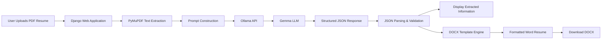

# LLM Resume Tool

An end-to-end **LLM-powered resume processing application** that extracts structured information from PDF resumes and automatically generates a standardized Microsoft Word resume.

The application combines **Django, Python, PyMuPDF, Ollama, Gemma, and DOCX templating** to transform an unstructured resume into structured JSON data and a formatted `.docx` document.

---

## Overview

Resume information often exists in inconsistent layouts and formats, making it difficult to standardize documents automatically.

This project demonstrates how a locally hosted Large Language Model can be integrated into a web application to:

1. Accept a resume through a browser
2. Extract text from the uploaded PDF
3. Send the extracted text to a local LLM
4. Convert the LLM response into structured JSON
5. Display the extracted resume information
6. Populate a standardized Word template
7. Allow the generated resume to be downloaded

The LLM is accessed through **Ollama**, allowing inference to run locally without requiring a third-party hosted LLM API.

---

## Architecture



---

## Key Features

- **PDF resume upload** through a Django web interface
- Automatic resume text extraction using **PyMuPDF**
- Local LLM inference using **Ollama**
- Configurable Ollama model through environment variables
- Prompt-based conversion of unstructured resume text into structured data
- JSON response parsing with fallback handling for imperfect LLM output
- Extraction of:
  - Name
  - Professional summary
  - Skills
  - Professional experience
  - Education
  - Certifications and specialized training
- Dynamic Word document generation using **docxtpl**
- Browser-based preview of extracted resume information
- Downloadable formatted `.docx` output
- Dockerized application
- Gunicorn production server configuration
- Azure Pipelines configuration for container build and deployment workflows

---

## Tech Stack

| Area | Technology |
|---|---|
| Language | Python |
| Web Framework | Django |
| LLM Runtime | Ollama |
| LLM | Gemma |
| PDF Processing | PyMuPDF |
| API Communication | Requests |
| Structured Output | JSON |
| Document Generation | docxtpl / python-docx |
| Database | SQLite |
| Frontend | HTML, CSS, JavaScript |
| Application Server | Gunicorn |
| Static Files | WhiteNoise |
| Containerization | Docker |
| CI/CD | Azure Pipelines |
| Container Registry | Azure Container Registry compatible pipeline |

---

## How It Works

### 1. Resume Upload

The Django application provides a browser interface where a user can upload a resume.

The current backend processes **PDF resumes**.

```text
Resume.pdf
      ↓
Django Upload View
```

---

### 2. PDF Text Extraction

The uploaded PDF is read in memory and processed using **PyMuPDF**.

Each page is parsed and combined into a single text representation of the resume.

```python
doc = fitz.open(stream=pdf_content, filetype="pdf")
text = "".join(page.get_text() for page in doc)
```

---

### 3. LLM Processing

The extracted resume text is inserted into a structured prompt and sent to an Ollama model through its REST API.

The model is instructed to return JSON using a predefined schema.

Example:

```json
{
  "name": "Candidate Name",
  "professional_summary": "Professional summary...",
  "professional_experience": [
    {
      "title": "Data Analyst",
      "company": "Company",
      "dates": "2024 - Present",
      "description": "Analyzed and transformed business data..."
    }
  ],
  "education": [
    {
      "degree": "Bachelor of Engineering",
      "institution": "University",
      "dates": "2020 - 2024"
    }
  ],
  "certification_&_specialized_training": [],
  "skills": [
    "Python",
    "SQL",
    "Power BI"
  ]
}
```

---

### 4. JSON Parsing

Because LLM output is not always perfectly formatted, the application first attempts strict JSON parsing.

If that fails, a fallback parser searches the response for the first valid JSON object.

```text
LLM Response
     ↓
Strict JSON Parsing
     ↓
Fallback JSON Extraction
     ↓
Python Dictionary
```

This provides an additional layer of reliability when working with generative model output.

---

### 5. Resume Generation

The parsed JSON is mapped to a Word document template using **docxtpl**.

The template supports fields including:

```text
name
professional_summary
skills
professional_experience
education
certification_specialized_training
```

The application then renders the template and generates a formatted Word document.

```text
Structured Resume Data
          +
    DOCX Template
          ↓
   docxtpl Engine
          ↓
  Formatted Resume.docx
```

---

### 6. Results

After processing, the application displays the extracted information in a structured table.

Users can then download the generated Word resume or return to process another resume.

---

## Project Structure

```text
LLMResume-Tool/
│
├── azure-pipelines.yml
│
└── tool/
    │
    ├── Dockerfile
    ├── manage.py
    ├── requirements.txt
    ├── llm_utils.py
    ├── fill_from_json.py
    ├── db.sqlite3
    ├── web.config
    │
    ├── tool/
    │   ├── __init__.py
    │   ├── settings.py
    │   ├── urls.py
    │   ├── views.py
    │   ├── asgi.py
    │   └── wsgi.py
    │
    ├── templates/
    │   ├── Final Template.docx
    │   ├── upload.html
    │   ├── upload_success.html
    │   └── generate_ready.html
    │
    ├── static/
    └── staticfiles/
```

---

## Getting Started

### Prerequisites

Make sure the following are installed:

- Python 3.11+
- Git
- Ollama
- Docker *(optional)*

---

## 1. Clone the Repository

```bash
git clone https://github.com/jaswanthk20/LLMResume-Tool.git

cd LLMResume-Tool/tool
```

---

## 2. Create a Virtual Environment

### Windows

```bash
python -m venv .venv
.venv\Scripts\activate
```

### macOS / Linux

```bash
python3 -m venv .venv
source .venv/bin/activate
```

---

## 3. Install Dependencies

```bash
pip install --upgrade pip
pip install -r requirements.txt
```

---

## 4. Install and Start Ollama

Install Ollama and pull the configured model.

```bash
ollama pull gemma:2b
```

Start Ollama if it is not already running:

```bash
ollama serve
```

By default, the application expects Ollama at:

```text
http://127.0.0.1:11434
```

---

## 5. Configure the LLM

The application supports environment-variable configuration.

| Variable | Default | Description |
|---|---|---|
| `OLLAMA_BASE_URL` | `http://127.0.0.1:11434` | Ollama server |
| `OLLAMA_MODEL` | `gemma:2b` | Ollama model |
| `OLLAMA_TIMEOUT` | `90` | Request timeout in seconds |

For example:

### Windows PowerShell

```powershell
$env:OLLAMA_MODEL="gemma:2b"
$env:OLLAMA_BASE_URL="http://127.0.0.1:11434"
```

### macOS / Linux

```bash
export OLLAMA_MODEL="gemma:2b"
export OLLAMA_BASE_URL="http://127.0.0.1:11434"
```

This makes it possible to experiment with other Ollama-compatible models without changing the application code.

---

## 6. Initialize Django

```bash
python manage.py migrate
python manage.py collectstatic --noinput
```

---

## 7. Run the Application

```bash
python manage.py runserver
```

Open:

```text
http://127.0.0.1:8000
```

Upload a PDF resume and allow the application to:

```text
PDF
 → Extract Text
 → LLM
 → JSON
 → DOCX Template
 → Formatted Resume
```

---

# Running with Docker

The application includes a Dockerfile based on Python 3.11.

Build the image from the `tool` directory:

```bash
docker build -t llmresume-tool .
```

Because Ollama normally runs on the host machine, provide the Ollama host address to the container.

### Windows / macOS

```bash
docker run --rm \
  -p 8000:8000 \
  -e OLLAMA_BASE_URL=http://host.docker.internal:11434 \
  llmresume-tool
```

### Linux

```bash
docker run --rm \
  --add-host=host.docker.internal:host-gateway \
  -p 8000:8000 \
  -e OLLAMA_BASE_URL=http://host.docker.internal:11434 \
  llmresume-tool
```

The Docker container runs Django through **Gunicorn** on port `8000`.

---

# CI/CD with Azure Pipelines

The repository also contains an `azure-pipelines.yml` configuration.

Commits to the `main` branch trigger a pipeline designed to:

```text
Push to main
      ↓
Azure Pipelines
      ↓
Build Docker Image
      ↓
Tag Image with Build ID
      ↓
Push Image to Azure Container Registry
```

The pipeline uses the Azure DevOps `Docker@2` task.

Before using the pipeline, replace:

```yaml
containerRegistry: '<your-acr-service-connection>'
```

with an Azure DevOps service connection configured for the target Azure Container Registry.

This provides the foundation for extending the application into an automated container deployment workflow.

---

# Example Processing Flow

```text
Candidate Resume
       │
       ▼
┌───────────────────┐
│   Django Upload   │
└─────────┬─────────┘
          │
          ▼
┌───────────────────┐
│  PyMuPDF Parser   │
└─────────┬─────────┘
          │
          ▼
┌───────────────────┐
│ Prompt Engineering│
└─────────┬─────────┘
          │
          ▼
┌───────────────────┐
│   Ollama + Gemma  │
└─────────┬─────────┘
          │
          ▼
┌───────────────────┐
│ Structured JSON   │
└─────────┬─────────┘
          │
          ▼
┌───────────────────┐
│ DOCX Templating   │
└─────────┬─────────┘
          │
          ▼
┌───────────────────┐
│ Formatted Resume  │
└───────────────────┘
```

---

# What This Project Demonstrates

This project explores several areas involved in building practical LLM applications:

**LLM Integration**

Integration with a locally hosted generative model through a REST API rather than relying exclusively on hosted AI services.

**Prompt Engineering**

Use of schema-constrained prompting to convert unstructured resume text into structured information.

**Document Processing**

Extraction of text from PDF documents and transformation of structured information into Microsoft Word documents.

**Backend Development**

Implementation of file uploads, session-based processing results, routing, error handling, and document generation using Django.

**Structured LLM Outputs**

Conversion and validation of generative model responses into application-ready JSON.

**Containerization**

Packaging of the Django application using Docker and serving it with Gunicorn.

**CI/CD**

Automated Docker build and container registry workflow using Azure Pipelines.

---

# Current Limitations

This repository is a prototype and provides opportunities for further development.

Current considerations include:

- Backend resume processing currently supports PDF input
- LLM extraction accuracy depends on resume structure and the selected model
- LLM-generated structured output may occasionally require additional validation
- The Word template is currently predefined
- Ollama must be accessible to the application at runtime
- Production deployments should move secrets and Django configuration into secure environment variables

---

# Future Improvements

Potential enhancements include:

- Support DOCX resume input
- Add drag-and-drop uploads
- Add multiple resume templates
- Allow users to preview the generated resume before downloading
- Introduce schema validation using Pydantic
- Add automated LLM response evaluation
- Add unit and integration tests
- Improve error handling and observability
- Add asynchronous document processing
- Support additional Ollama models
- Add hosted LLM provider support
- Store processing history in a persistent database
- Add authentication and role-based access
- Deploy the containerized application to Azure
- Add automated testing to the CI/CD pipeline

---

# Skills Demonstrated

`Python` · `Django` · `LLMs` · `Ollama` · `Gemma` · `Prompt Engineering` · `REST APIs` · `JSON` · `PyMuPDF` · `DOCX Automation` · `Docker` · `Gunicorn` · `Azure DevOps` · `Azure Pipelines` · `CI/CD`

---

## Author

**Jaswanth Kumaar**

GitHub: [@jaswanthk20](https://github.com/jaswanthk20)

---

If you found this project useful or interesting, feel free to explore the repository and provide feedback.
